# Informe de proyecto: Análisis Exploratorio de Ventas E-commerce

## Indice

1. [Introducción](#1-introducción)
2. [Objetivos del Proyecto](#2-objetivos-del-proyecto)
3. [Descripción Temática de los Datos](#3-descripción-temática-de-los-datos)
4. [Hipótesis iniciales](#4-hipótesis-iniciales)
5. [Usuario Final y Nivel de Aplicación del Análisis](#5-usuario-final-y-nivel-de-aplicación-del-análisis)
6. [Análisis Exploratorio de Datos](#6-análisis-exploratorio-de-datos)
   - [6.1. Ventas Generales](#61-ventas-generales)
   - [6.2. Productos](#62-productos)
   - [6.3. Categorías](#63-categorías)
   - [6.4. Clientes](#64-clientes)
   - [6.5. Regiones o zonas](#65-regiones-o-zonas)
   - [6.6. Dispositivos](#66-dispositivos)
   - [6.7. Logística y Entregas](#67-logística-y-entregas)
7. [Conclusiones y Recomendaciones](#7-conclusiones-y-recomendaciones)
8. [Anexo y Recursos](#8-anexo-y-recursos)

## 1. Introducción

En el contexto actual del comercio digital, comprender el comportamiento de los clientes y el desempeño de los productos es clave para tomar decisiones informadas que impulsen las ventas y mejoren la eficiencia operativa. Este proyecto tiene como objetivo realizar un análisis exploratorio de un conjunto de datos reales de ventas de e-commerce, utilizando herramientas de Python y buenas prácticas de análisis de datos.

El análisis se centra en identificar patrones relevantes en las transacciones, detectar oportunidades comerciales no explotadas y generar insights accionables para áreas como marketing, ventas y logística. A lo largo del proyecto se aplicarán técnicas de limpieza, transformación, visualización y segmentación de datos, buscando responder preguntas clave del negocio tales como: ¿qué productos o categorías conviene promocionar?, ¿quiénes son los mejores clientes?, ¿cómo influyen los descuentos en el comportamiento de compra?, ¿qué regiones tienen mayor potencial comercial?, entre otras.

La información analizada proviene de un dataset disponible públicamente en Kaggle, que reúne un año de operaciones comerciales en una plataforma de e-commerce en América. Este conjunto de datos incluye variables como fecha de compra, producto, categoría, precio, cliente, ciudad de envío, tipo de dispositivo, tipo de inicio de sesión y tiempo de entrega.

En este informe se presenta un análisis exploratorio de un conjunto de datos de ventas de e-commerce con el objetivo de identificar patrones, tendencias y relaciones entre las variables. El conjunto de datos incluye información sobre transacciones, productos, clientes y categorías. Se utilizarán bibliotecas de Python como Pandas, Matplotlib y Seaborn para realizar el análisis.

## 2. Objetivos del Proyecto

El propósito principal de este proyecto es llevar a cabo un análisis exploratorio y visual de un conjunto de datos reales de ventas de e-commerce, con el fin de identificar patrones de comportamiento, evaluar el rendimiento comercial y generar conclusiones accionables que puedan apoyar la toma de decisiones estratégicas.

A través del uso de herramientas del ecosistema Python, se buscará responder una serie de preguntas clave del negocio vinculadas a productos, clientes, regiones y canales de compra. Este análisis incluirá desde la limpieza y transformación de los datos hasta la elaboración de visualizaciones que permitan comunicar hallazgos de forma clara y efectiva.

## 3. Descripción Temática de los Datos

Este proyecto se basa en un conjunto de datos reales de transacciones de e-commerce a lo largo de un año en América. El dataset refleja operaciones de compra online que contienen información tanto del cliente como del producto adquirido, la categoría, la cantidad y precio, el dispositivo utilizado y la región de destino.

El análisis está orientado a comprender los hábitos de consumo, identificar productos y categorías clave, evaluar el desempeño por regiones, y descubrir oportunidades de negocio a través de la visualización y exploración de datos.

Fuente: [Dataset de E-commerce](https://www.kaggle.com/datasets/mervemenekse/ecommerce-dataset)

## 4. Hipótesis inicales

Previo al análisis de datos, se plantean una serie de hipótesis que guían el enfoque exploratorio del proyecto. Estas hipótesis surgen tanto del conocimiento previo sobre dinámicas comunes del e-commerce como de preguntas estratégicas clave para áreas de marketing, ventas y logística.

Se parte de la idea de que las ventas presentan patrones estacionales, con meses de mayor actividad comercial —como diciembre— debido a campañas o eventos especiales. Asimismo, se espera que algunas categorías de productos concentren una parte significativa de los ingresos, ya sea por alto volumen de ventas o por su rentabilidad individual.

También se presupone que ciertas regiones o zonas presentan un bajo volumen de ventas pero un ticket promedio elevado, lo cual podría indicar oportunidades comerciales no explotadas. Del mismo modo, se plantea que los clientes frecuentes y con comportamiento repetitivo aportan más valor al negocio, y que estos podrían identificarse para estrategias de fidelización.

En cuanto a los factores operativos, se cree que el tiempo de entrega impacta en la satisfacción del cliente, y que puede variar significativamente entre regiones o meses. Por otro lado, se anticipa que el tipo de dispositivo (móvil o web) y el tipo de inicio de sesión (miembro o invitado) pueden influir en el comportamiento de compra, como el monto gastado o la cantidad de productos adquiridos.

Finalmente, se buscará explorar si existen diferencias relevantes por género, tanto en los productos comprados como en las categorías preferidas, así como patrones de compra relacionados con la fecha y la hora (como días de mayor tráfico o franjas horarias más activas).

## 5. Usuario Final y Nivel de Aplicación del Análisis

**Uuario Final**: Equipos de marketing, ventas y analistas de negocio en una empresa de e-commerce.

**Nivel de Aplicación**: Estratégico-operativo. El análisis busca dar soporte a decisiones tácticas sobre promociones, segmentación de clientes, optimización logística y diseño de campañas comerciales.

## 6. Análisis Exploratorio de Datos

### 6.1. Ventas Generales

**Objetivo**: Analizar el volumen y la evolución total de ventas, así como identificar patrones según el calendario y el horario.

#### Total de ventas ($ y unidades).

Se vendieron un total de $7.812.164 y 128.357 unidades en el período analizado. Este valor nos da un panorama inicial sobre el volumen del negocio, permitiendo evaluar estrategias comerciales o presupuestarias.

#### Ventas mensuales

El gráfico de línea muestra que las ventas tienen un comportamiento creciente a lo largo del año, con picos notables en los meses de mayo, julio y noviembre. Esto puede reflejar estacionalidad, promociones u otras campañas comerciales.

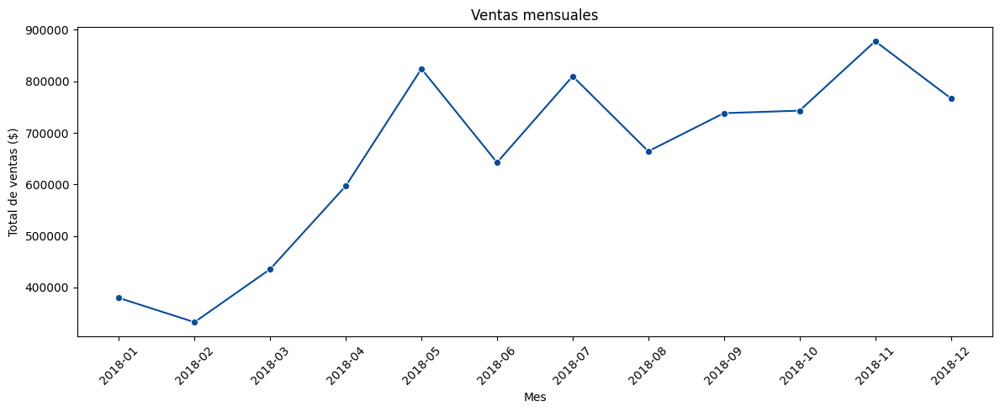

#### Ventas por hora y día

Según el mapa de calor, las ventas se concentran mayormente entre las 10:00 y las 22:00, especialmente los días martes y miércoles. Esto es coherente con los picos vistos en el gráfico anterior y sugiere que los usuarios compran más en horario laboral/tarde.

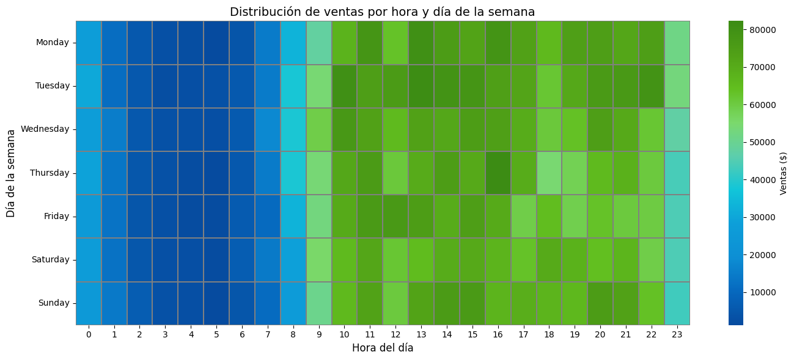

Preguntas que responde:

**¿Cómo influyen la fecha y la hora en las ventas?**

Se observa un patrón semanal donde martes y miércoles concentran las mayores ventas, y un patrón horario que indica más actividad entre las 10:00 y las 22:00. Además, se identifica una evolución mensual creciente, con ciertos picos estacionales que podrían relacionarse con campañas o fechas comerciales.

### 6.2. Productos

Objetivo: Evaluar el desempeño de los productos según cantidad vendida, rentabilidad y efecto de los descuentos.

#### Top 10 productos más vendidos

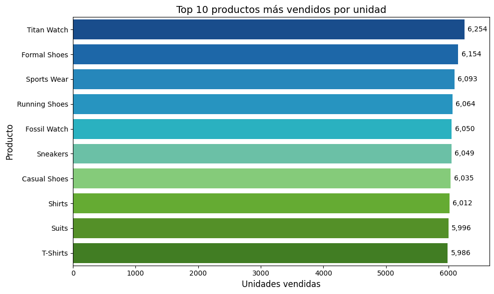

El gráfico muestra que los productos más vendidos en unidades fueron:

- Titan Watch (6.254 unidades),
- Formal Shoes, Sports Wear y Running Shoes (más de 6.000 cada uno),
- así como Fossil Watch, Sneakers y T-Shirts.

Esto indica una alta rotación de estos productos, lo que puede deberse a popularidad, precio accesible o campañas efectivas.

#### Productos más rentables

En cuanto a ganancia total, los T-Shirts lideran el ranking con más de $340.000, seguidos por Titan Watch, Running Shoes y Jeans. A pesar de no ser los más vendidos en unidades, algunos productos (como Jeans, Towels y Sofa Covers) destacan por su alto margen unitario.

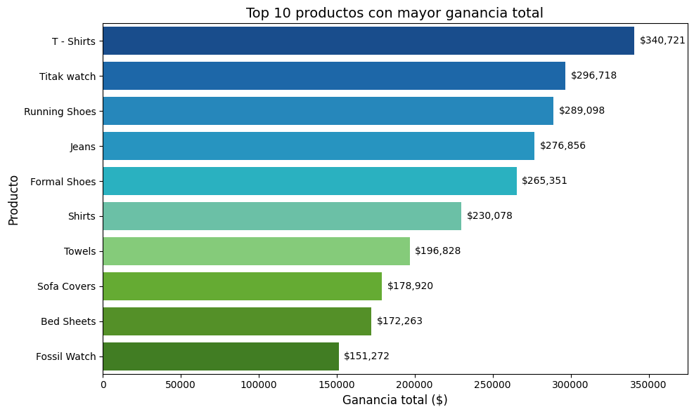

#### Comparación de productos con y sin descuentos

Al analizar los 10 productos más vendidos en valor, se observa que todos fueron vendidos exclusivamente con descuentos. Esto evidencia una fuerte dependencia del precio promocional para alcanzar altos niveles de venta. Es probable que estos productos tengan una alta sensibilidad al precio, por lo que las promociones cumplen un rol clave en su desempeño.

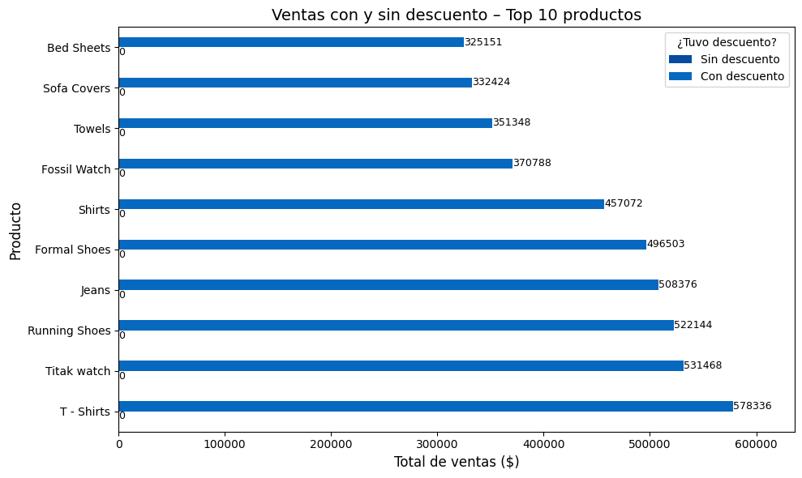

Preguntas que responde:

**¿Qué productos conviene promocionar?**
Los productos que aparecen en el Top 10 de unidades vendidas y ganancia total (como "T-Shirts", "Titan Watch", "Formal Shoes") muestran un buen rendimiento general. Además, al venderse completamente con descuento, se sugiere continuar promocionándolos para mantener su volumen.

**¿Qué producto obtiene más beneficios por unidad?**

Aunque no se muestra en forma directa, productos como "T-Shirts" y "Running Shoes" aparecen tanto en los rankings de volumen como en el de ganancia, lo que indica una alta rentabilidad por unidad.

**¿Cómo afectan los descuentos a las ventas?**

Se observa que en todos los casos del Top 10 de ventas en valor, las ventas se lograron solo cuando se aplicaron descuentos, lo que sugiere que los descuentos fueron determinantes para el volumen de ventas.

### 6.3. Categorías

Objetivo: Evaluar el desempeño de las categorías.

#### Ventas totales por categoría

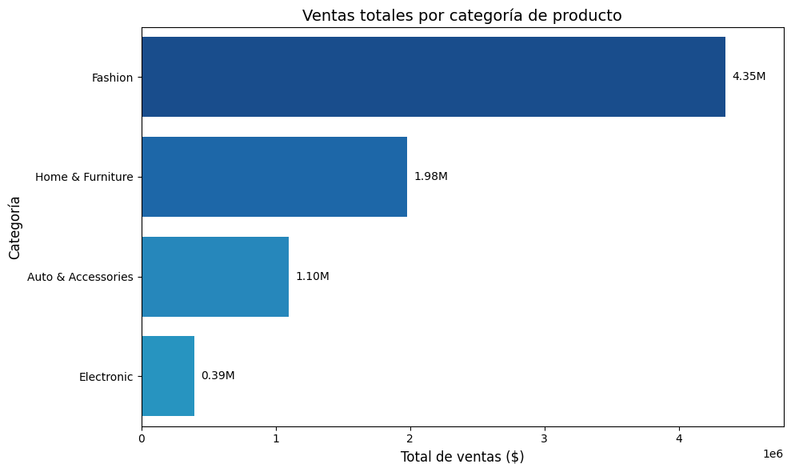

- Fashion lidera con más de **$4.35M**, duplicando a Home & Furniture **($1.98M)**.
- Esto demuestra que la categoría de moda es claramente la más relevante en términos de facturación.

#### Ticket promedio por categoría.

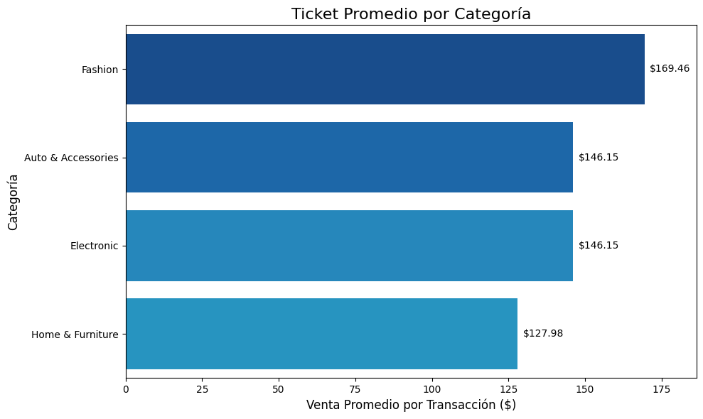

- Fashion también tiene el ticket promedio más alto: $169.46, lo que indica que las compras individuales en esta categoría son de mayor valor.
- Las demás rondan entre $127.98 y $146.15, con Home & Furniture como la de menor ticket promedio.

#### Productos más vendidos dentro de cada categoría.

| Id  | Product_Category   | Product                | Quantity |
| --- | ------------------ | ---------------------- | -------- |
| 2   | Auto & Accessories | Car Body Covers        | 2040.0   |
| 5   | Auto & Accessories | Car Pillow & Neck Rest | 2012.0   |
| 8   | Auto & Accessories | Tyre                   | 2010.0   |
| 18  | Electronic         | Speakers               | 581.0    |
| 10  | Electronic         | Fans                   | 523.0    |
| 17  | Electronic         | Samsung Mobile         | 501.0    |
| 31  | Fashion            | Titak watch            | 6254.0   |
| 22  | Fashion            | Formal Shoes           | 6154.0   |
| 28  | Fashion            | Sports Wear            | 6093.0   |
| 33  | Home & Furniture   | Beds                   | 3908.0   |
| 36  | Home & Furniture   | Dinning Tables         | 3874.0   |
| 38  | Home & Furniture   | Sofa Covers            | 3852.0   |

Esto muestra que dentro de cada categoría hay productos estrella con alto desempeño.

#### Distribución por género dentro de cada categoría

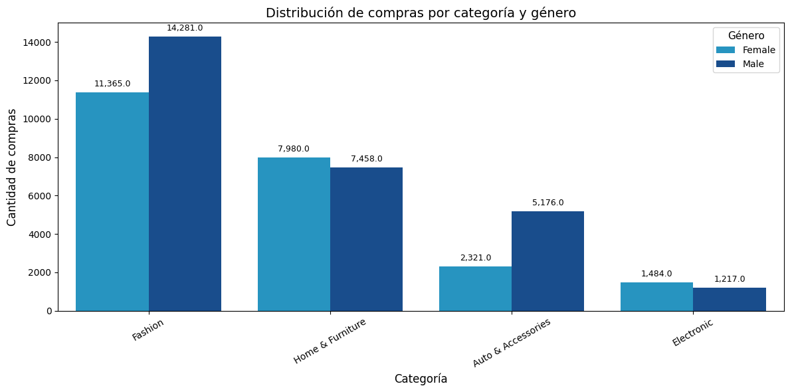

- Fashion es la categoría más comprada por ambos géneros, aunque con mayor volumen por hombres (14.281) que mujeres (11.365).

- Home & Furniture tiene una distribución más pareja.

- En Auto & Accessories, predominan los hombres.

- En Electronic, la diferencia es mínima.

Preguntas que responde:

**¿Qué categorías conviene promocionar?**

Fashion, por su volumen total de ventas, alto ticket promedio y fuerte demanda en ambos géneros. También puede convenir Auto & Accessories, por su buen ticket y alto interés masculino.

**¿Qué categorías de productos vendo?**

Fashion, Home & Furniture, Auto & Accessories, y Electronic.

**¿Distribución por género/categoría?**

Hombres compran más en todas las categorías menos en Home & Furniture, donde hay un equilibrio. Fashion es dominante en ambos géneros, ideal para campañas generales.

### 6.4. Clientes

Objetivo: Conocer el comportamiento de los clientes.

#### ¿Quiénes son los que más compran?

El gráfico del **Top 10 clientes** con mayor gasto total revela que los clientes con mayor facturación individual superaron los $890, llegando el principal comprador a $994. Aunque representan una fracción pequeña del total, estos clientes concentran un alto valor de compra, por lo cual son candidatos ideales para estrategias de **fidelización personalizada** o programas de recompensas.

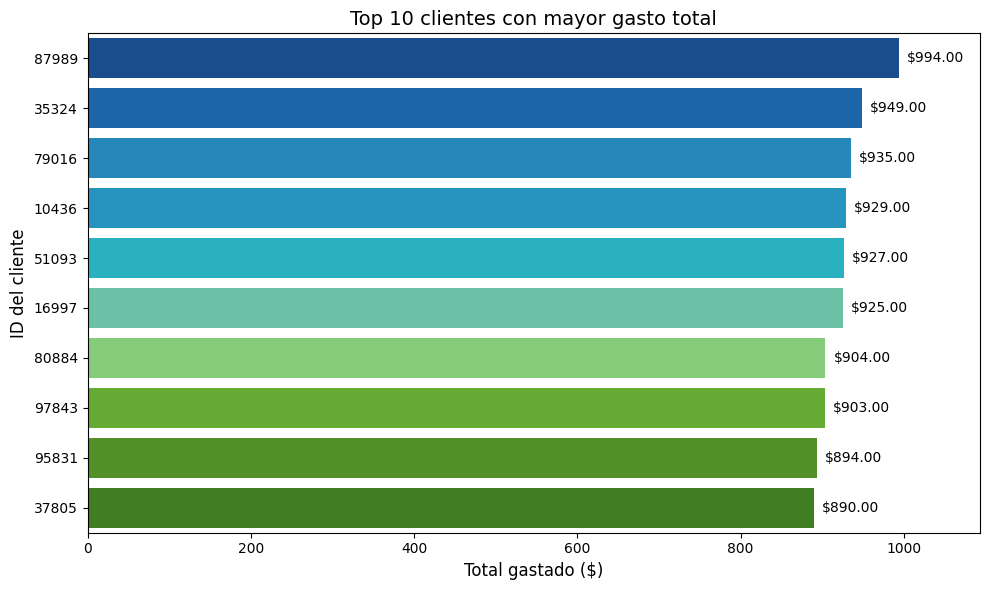

#### Ticket promedio por cliente

La distribución del ticket promedio indica una media de $150,85, pero con una notable dispersión. Se detectan dos grupos prominentes: uno con tickets promedio inferiores a $100 y otro que supera los $200. Esto sugiere que existen segmentos bien diferenciados dentro de la base: clientes de bajo gasto y clientes de alto valor, sobre los cuales se podrían diseñar **estrategias diferenciadas** de retención y comunicación.

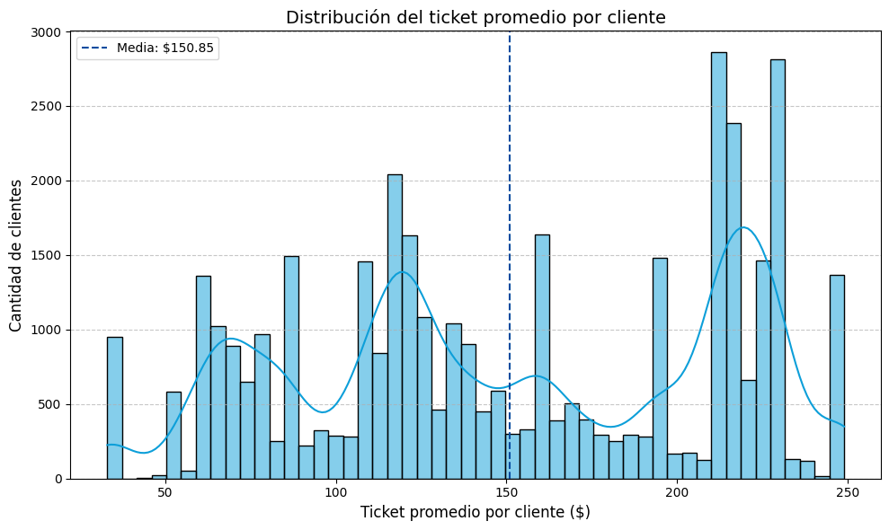

#### Frecuencia de compra

La mayoría de los clientes realizaron **una sola compra** (28.825), y una proporción mucho menor realizó dos (8.321) o más compras. Este comportamiento señala una baja tasa de recompra, lo que plantea un desafío —y también una oportunidad— para desarrollar programas de lealtad o remarketing orientados a aumentar la frecuencia de compra.

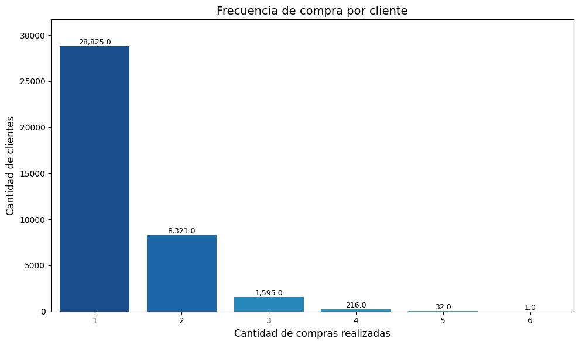

#### Análisis por tipo de login

El tipo de login muestra que la mayoría de las compras fueron realizadas por **usuarios registrados** ("Member"), lo que representa más del 95 % del total. Los usuarios “Guest”, “First SignUp” o “New” son una minoría. Esto es positivo, ya que el login permite un seguimiento individualizado, mejorando la capacidad de segmentación y personalización en futuras campañas.

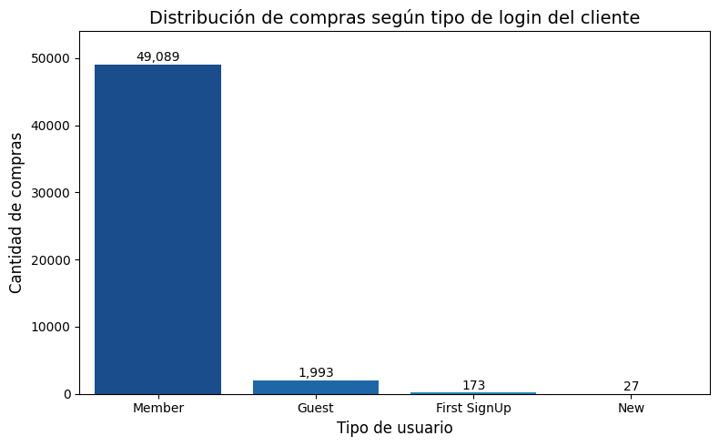

#### Distribución por género

Se observa que los hombres realizaron más compras que las mujeres: 28.132 vs 23.150. Esta diferencia, aunque no extrema, puede tener implicancias al segmentar campañas y productos.

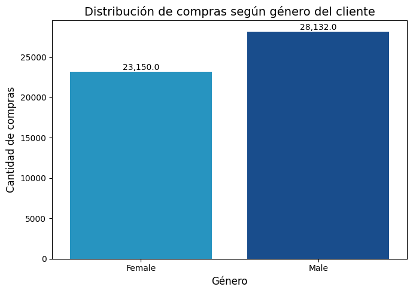

Preguntas que responde:

**¿Quiénes conforman mi base de clientes?**

Usuarios registrados (Members), mayoritariamente hombres, con baja frecuencia de compra y tickets promedio diversos.

**¿Qué clientes deberían estar en un programa de fidelización?**

Aquellos identificados en el top 10 de gasto total, además de los clientes con tickets promedio altos o con más de una compra realizada.

**¿Qué tipo de inicio de sesión prefieren mis clientes?**

El login tipo “Member” es claramente dominante, lo que facilita la aplicación de estrategias personalizadas y seguimiento histórico.

**¿A quién le vendo qué categorías? (cruce cliente-género-producto)**

- Fashion: popular entre ambos géneros, con ligera preferencia masculina.
- Home & Furniture: con reparto equilibrado.
- Auto & Accessories: principalmente hombres.
- Electronics: consumo levemente mayor en mujeres, lo que sugiere interés femenino en tecnología y hogar digital.

### 6.5. Dispositivos

Objetivo: Ver patrones por canal de acceso.

#### Ventas por tipo de dispositivo (web vs mobile).

El análisis de ventas según tipo de dispositivo revela una amplia preferencia por el uso de la Web, que concentra aproximadamente $7,25 millones en ventas, frente a los $0,56 millones generados desde dispositivos móviles. Esto representa más del 92 % del total procesado a través de la plataforma web, marcando una gran brecha en el comportamiento de compra según dispositivo.

Este dato evidencia que los usuarios prefieren realizar sus compras desde computadoras o navegadores web, ya sea por comodidad, visibilidad o mayor confianza en el proceso de pago. Es una señal clara para enfocar recursos en seguir optimizando la experiencia web, aunque también representa una oportunidad de mejora para el canal mobile, posiblemente poco desarrollado o con menor usabilidad.

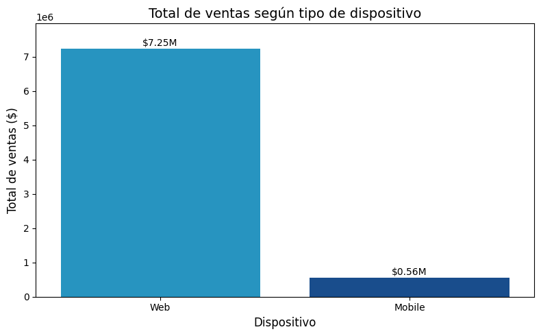

#### Comportamiento comparado: ticket promedio, cantidad de productos.

| Device_Type | Ticket Promedio | Unidades Promedio | Cantidad de Compras |
| ----------- | --------------- | ----------------- | ------------------- |
| Mobile      | 154.002187      | 2.336249          | 3658                |
| Web         | 152.209474      | 2.515769          | 47624               |

Pese a la enorme diferencia en volumen de compras, los usuarios móviles muestran un ticket promedio levemente superior y una cantidad de unidades por compra apenas inferior. Esto sugiere que, si bien la plataforma mobile no es la principal vía de conversión, los usuarios que compran desde allí son valiosos en términos de gasto.

Pregunta que responde:

**¿Qué dispositivos usan mis clientes para contactarme?**

Principalmente utilizan navegadores web desde computadoras o notebooks. Los móviles representan una minoría en volumen total de compras, aunque quienes los usan gastan igual o incluso un poco más por transacción. Hay una clara oportunidad de mejorar el rendimiento del canal móvil.

### 6.6. Logística y Entregas

Objetivo: Evaluar eficiencia en la entrega.

#### Distribución de “Aging” (días de entrega).

El gráfico a continuación muestra la cantidad de órdenes según los días que transcurrieron desde que se realizó la compra hasta que fue entregada:

La mayoría de las órdenes (7.467) se entregaron en un solo día, lo cual indica una buena capacidad de respuesta logística. El resto de las entregas se distribuye de manera bastante uniforme entre los días 2 y 10, lo cual sugiere que, si bien el promedio ronda los 5 días, hay una porción importante de entregas rápidas.

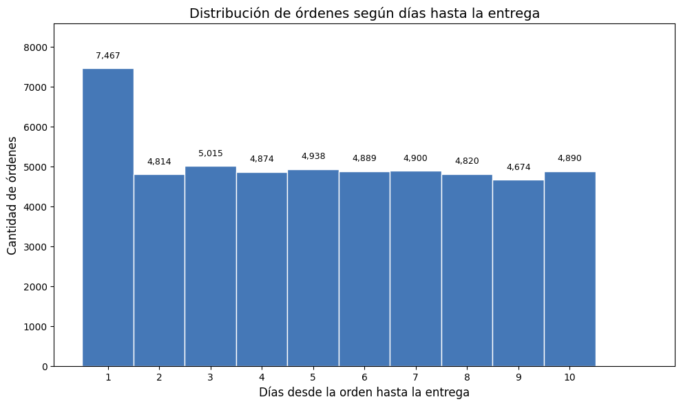

#### Comparación por mes

En esta línea temporal se observa que el tiempo promedio de entrega se mantiene relativamente constante a lo largo de los meses, oscilando entre 5.18 y 5.31 días. El mes con mayor rapidez fue noviembre, con un promedio de 5.18 días, mientras que marzo y diciembre presentaron los valores más altos (5.31 días), aunque las diferencias son poco significativas. Esto demuestra una buena estabilidad en los tiempos logísticos.

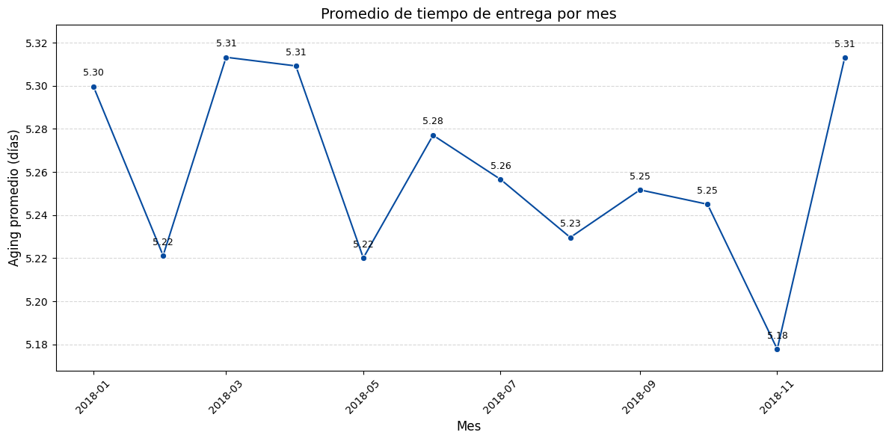

Pregunta que responde:

**¿Cuál es mi velocidad de entrega y cómo varía?**

- La velocidad de entrega promedio es de aproximadamente 5 días.
- La mayoría de las entregas se realiza entre 1 y 5 días, con un pico en el primer día.
- A lo largo de los meses, los tiempos de entrega se mantienen estables, lo cual refleja una logística consistente y eficiente.

## 7. Conclusiones y Recomendaciones

El análisis exploratorio realizado permitió identificar patrones relevantes en el comportamiento de compra, rendimiento de productos y eficiencia logística en una plataforma de e-commerce. A partir de los hallazgos, se extraen las siguientes conclusiones y recomendaciones clave:

- **Ventas con fuerte estacionalidad**: Se detectan picos de ventas en los meses de mayo, julio y noviembre, lo cual sugiere que existen períodos claves de alto rendimiento comercial posiblemente asociados a campañas o eventos específicos.
- **Categorías y productos estrella**: La categoría Fashion domina en volumen de ventas y ticket promedio. Productos como T-Shirts, Titan Watch y Running Shoes concentran un alto desempeño, sobre todo cuando se aplican descuentos.

- **Dependencia de las promociones**: Los productos más vendidos en valor fueron comercializados exclusivamente con descuentos, lo que indica una alta sensibilidad al precio por parte de los clientes.

- **Clientes poco fidelizados**: La mayoría de los clientes realizó una sola compra, lo cual revela una baja retención. No obstante, existe un grupo reducido de alto valor que justifica estrategias de fidelización diferenciadas.

- **Dispositivo como canal de compra**: La Web es el canal dominante, pero los usuarios móviles tienen un ticket promedio ligeramente mayor. Esto revela una oportunidad de mejora en la experiencia mobile.

- **Eficiencia logística estable**: La mayoría de las entregas se completan en 1 a 5 días, con un promedio general de 5 días que se mantiene constante durante el año.
